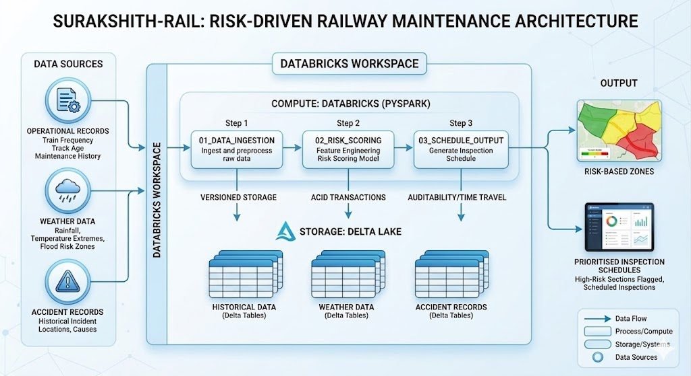

# Surakshith-Rail
Risk-Driven Railway Maintenance & Predictive Analytics Platform

**Surakshith-Rail** shifts India's railway maintenance from a traditional schedule-driven model to a proactive, **risk-driven** approach. By integrating historical operational data, weather patterns, and accident records, the system identifies hazardous track sections and assigns risk scores — ensuring critical areas are inspected *before* accidents occur.

Built on **Databricks** with **PySpark** and **Delta Lake** for robust data handling and versioning.

---

## How It Works

```
Historical Data + Weather + Accident Records
  → PySpark preprocessing on Databricks
  → Delta Lake versioned storage
  → Risk scoring model identifies hazardous sections
  → Risk score assigned per track segment
  → Prioritised inspection schedule generated
```

---

## Architecture & Data Stack

The project is built on **Databricks** using **PySpark** and **Delta Lake** for robust data handling and versioning.

| Layer | Technology |
|---|---|
| Compute | Databricks (PySpark) |
| Storage | Delta Lake |
| Data Sources | Historical operations, weather patterns, accident records |
| Output | Risk-scored track segments + inspection schedules |

---

## Key Features

- **Risk Scoring** — Each track section receives a quantitative risk score based on multiple data signals
- **Proactive Scheduling** — High-risk sections are flagged for inspection before incidents occur, not after
- **Multi-source Fusion** — Combines operational history, real-time weather, and past accident data
- **Versioned Data** — Delta Lake ensures full auditability and rollback of all datasets
- **Scalable Pipeline** — PySpark enables processing across large railway networks without bottlenecks

---

## Getting Started

### Prerequisites

- Databricks workspace (Free Edition or above)
- Python 3.8+
- PySpark
- Delta Lake

### Setup

```bash
# Clone the repository
git clone https://github.com/your-org/surakshith-rail.git

# Open in Databricks and attach to a cluster
# Import notebooks from /notebooks directory
# Configure data paths in config/settings.py
```

### Running the Pipeline

```python
# 1. Ingest and preprocess raw data
%run ./notebooks/01_data_ingestion

# 2. Feature engineering and risk scoring
%run ./notebooks/02_risk_scoring

# 3. Generate inspection schedule
%run ./notebooks/03_schedule_output
```

---

## Data Sources

| Source | Description |
|---|---|
| Operational Records | Train frequency, track age, maintenance history |
| Weather Data | Rainfall, temperature extremes, flood-risk zones |
| Accident Records | Historical incident locations and causes |

---


##Architecture diagram
